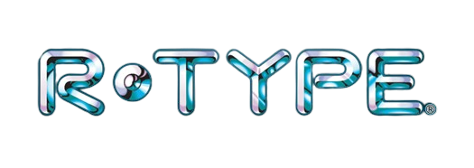

# R-Type

[](https://github.com/Z4RM/Epitech-Tek3-CPP-R-Type/actions)

This game is informally called a "Horizontal Shmup" (or simply, a _Shoot’em’up_), and while **R-Type** is not the first one of its category, it has been a huge success amongst gamers in the 90’s, and had several ports, spin-offs, and 3D remakes on modern systems.

Other similar and well-known games are the **Gradius** series and **Blazing Star** on **Neo Geo**.

This project is a new version of **R-Type**, with additional features not featured in the original game:

- It's a networked game, where several players are able to fight the evil Bydos.
- Its internal design demonstrates architectural features of a real game engine.

## Documentation

You can consult the documentation (for users/players and developers) [here](https://github.com/Z4RM/Epitech-Tek3-CPP-R-Type/wiki).

## Tech Stack

- **Supported platforms:**
  - Linux
  - Windows
  - macOS (not tested, but it should definitely work due to common points between Linux and macOS)
- **Language:** C++ 17
- **Package manager:** Conan
- **Build tool:** CMake
- **External libraries used:**
  - SFML (2.6.2) - Graphic library used by our game
  - Asio - Cross-platform library for network and low-level I/O programming
  - inih - [.INI file](https://wikipedia.org/wiki/INI_file) parser
  - nlohmann's json - [.JSON file](https://wikipedia.org/wiki/JavaScript_Object_Notation) parser
  - spdlog - Fast C++ logging library

## Configuration

To configure some parts of the **R-Type** you can provide a `config.ini` file
containing specifics configuration keys.

To do this, you can copy the `config.ini.example` file to `config.ini` and configure each key.
All the keys and their possible values are explained in the example file.

## Run Locally

Clone the project

```bash
git clone https://github.com/Z4RM/Epitech-Tek3-CPP-R-Type.git
```

Go to the project directory

```bash
cd Epitech-Tek3-CPP-R-Type
```

Follow the installation steps on the wiki: [Build and manage packages](https://github.com/Z4RM/Epitech-Tek3-CPP-R-Type/wiki/Build-and-manage-packages).

Start the server and/or the client

```bash
build/r-type_server
build/r-type_client
```

## Linting

We use [**Super-Linter**](https://github.com/super-linter/super-linter) to ensure that the codebase is clean and consistent.

To run it locally, you can use the following command:

```bash
docker run --rm \
           -e RUN_LOCAL=true \
           --env-file ".github/super-linter.env" \
           -v "$(pwd)":/tmp/lint \
           ghcr.io/super-linter/super-linter:latest
```

## Continuous Integration (CI)

This repository uses GitHub Actions for Continuous Integration (CI) to ensure the quality and stability of the codebase.

### Key Features

- Automated testing and linting on every push.
- Build verification to confirm successful project compilation.

### Documentation

For a detailed overview of the CI workflows, see the [CI Workflows README](.github/workflows/README.md).

This documentation includes:

- A breakdown of CI pipeline steps.
- A schema of the workflow.

Refer to the [`.github/workflows/README.md`](.github/workflows/README.md) for guidance on extending or troubleshooting the CI setup.

## Support

For support, you can [open an issue](https://github.com/Z4RM/Epitech-Tek3-CPP-R-Type/issues/new/choose).

## Contributing

Contributions are always welcome!

See [CONTRIBUTING.md](CONTRIBUTING.md) for ways to get started.
Please follow the guidelines to contribute to the project.

Please adhere to this project's [code of conduct](CODE_OF_CONDUCT.md).

## License

[GNU GPL](https://choosealicense.com/licenses/gpl-3.0)

See [LICENSE](LICENSE) for more details.

> Ce projet est une réalisation académique créée dans le cadre d'un projet pour **Epitech**. Il n'est en aucun cas affilié ou approuvé par **Irem** ou les détenteurs des droits de "**R-Type**". Tous les éléments du projet sont conçus indépendamment, sans utiliser les ressources ou le code de l'œuvre originale.

## Authors

- [@Clement-Z4RM](https://github.com/Clement-Z4RM) | [@Z4RM](https://github.com/Z4RM)
- [@josephinecr](https://github.com/josephinecr)
- [@MathisZUCCHERO](https://github.com/MathisZUCCHERO)
- [@pablo-1610](https://github.com/pablo-1610)
- [@RemFdz](https://github.com/RemFdz)
